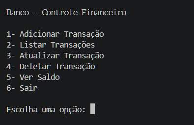
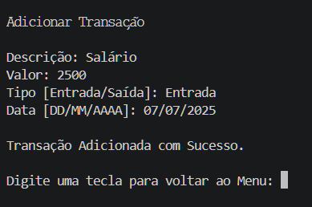
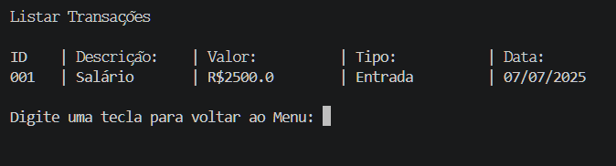

# Sistema de Controle Financeiro

Projeto desenvolvido em Python com SQLite para gerenciamento de transações financeiras diretamente pelo terminal.

---

## Tecnologias Utilizadas

- Python
- SQLite
- Regex

---

## Funcionalidades

- Adicionar transações
- Listar transações
- Atualizar transações
- Deletar transações
- Ver saldo total
- Persistência de dados com SQLite
- Validação de dados
- Formatação de IDs

---

## Conceitos Aplicados

- CRUD
- Banco de Dados
- SQLite
- Regex
- Modularização
- Tratamento de erros
- Funções
- Estruturas de repetição
- Validação de entrada

---

## Como Executar

Clone o repositório:

```bash
git clone https://github.com/mansurkv/controle-financeiro
```

Entre na pasta:

```bash
cd controle-financeiro
```

Execute o projeto:

```bash
python app.py
```

---

## Estrutura do Projeto

```text
controle_financeiro/
│
├── Images/
├── app.py
├── banco.py
├── README.md
└── .gitignore
```

---

## Demonstração




---

## Melhorias Futuras

- Criar API com FastAPI
- Adicionar autenticação de usuário
- Criar dashboard financeiro
- Gerar relatórios por mês

## Autor

Matheus Mansur Kadi Veludo
